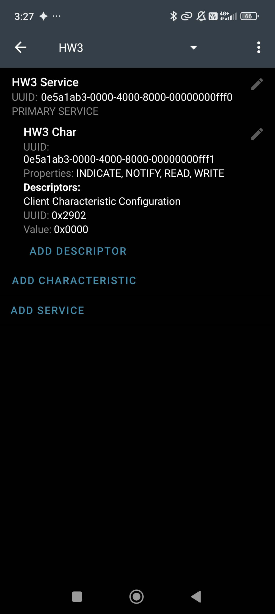
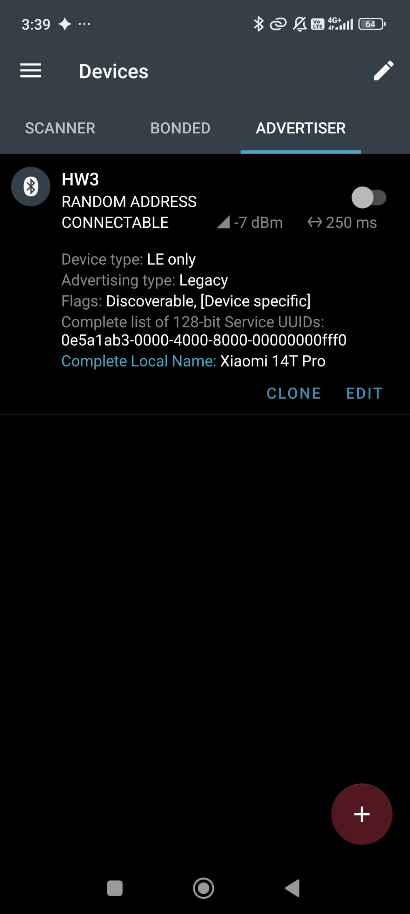
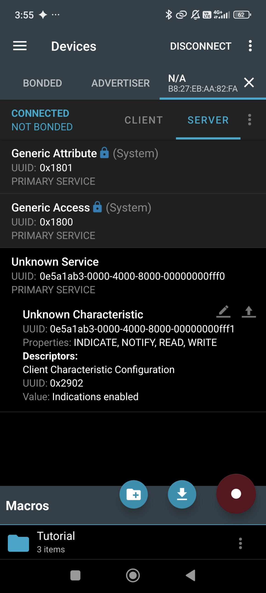
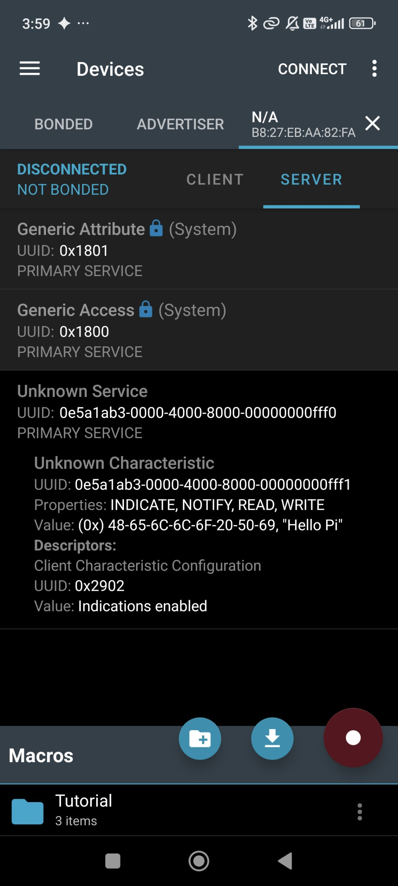

# Lab 3 — BLE Central（Raspberry Pi + Python）

Raspberry Pi 3 以 Python 擔任 **BLE Central（GATT client）**，連線到 Android 手機上 nRF Connect 建立的
**GATT server**，直接把自訂 characteristic 的 **CCCD 寫成 0x0002（開啟 indication）**，再接收手機送出的 indication。
完成基本題；選作（C + GATTLIB）未做。

## 實作架構

```text
Raspberry Pi 3（Central / GATT client）               Android 手機（Peripheral / GATT server）
ble_central.py（bluepy）                              nRF Connect for Mobile
  1. 掃描，依廣播中的 service UUID 篩選     ◀── adv ──   Advertiser：128-bit Service UUID（Legacy, Connectable）
  2. 連線、探索 GATT                        ── conn ──▶   HW3 Service  0e5a1ab3-0000-4000-8000-00000000fff0
  3. ATT Write Request：CCCD ← 02 00        ─────────▶     └ HW3 Char  …fff1  [Read, Write, Notify, Indicate]
  4. 收 Handle Value Indication，自動回 Confirmation ◀──        └ CCCD 0x2902
```

- Pi：Raspberry Pi 3、Raspberry Pi OS Lite 64-bit（Debian 13 trixie）、Python 3.13、BlueZ 5.82、bluepy 1.3.0。
- 手機：Android（Xiaomi 14T Pro）、nRF Connect for Mobile 的 GATT server 與 Advertiser。
- Pi 以 headless 方式操作：Raspberry Pi Imager 預先設定 hostname、Wi-Fi、SSH，從筆電 `ssh` 進去。

## 檔案

| 路徑 | 說明 |
|---|---|
| `pi/ble_central.py` | 主程式：掃描 → 連線 → 列出 GATT → 寫 CCCD → 讀回 → 接收 indication |
| `pi/setup_pi.sh` | Pi 一次性安裝：venv、bluepy、`setcap`、開啟藍牙 |
| `docs/screenshots/` | 手機端設定與結果截圖 |
| `logs/` | Pi 端執行紀錄 |

## 執行

### 1. Pi 安裝（一次）

```bash
cd lab3/pi
bash setup_pi.sh
```

會安裝 `libglib2.0-dev` 等編譯套件、建立 `~/hw3-venv` 並從原始碼編譯 bluepy，
再以 `setcap cap_net_raw,cap_net_admin+eip` 授權 `bluepy-helper`，掃描不需 sudo。

### 2. 手機 nRF Connect 設定

**Configure GATT server**（新增設定 `HW3`，並在下拉選單選用它）

| 項目 | 設定 |
|---|---|
| Service | `0e5a1ab3-0000-4000-8000-00000000fff0`，primary |
| Characteristic | `0e5a1ab3-0000-4000-8000-00000000fff1`；Properties：Read / Write / Notify / Indicate；Permissions：Read / Write |
| Descriptor | CCCD（0x2902）由 nRF Connect 自動加入，初值 0x0000 |

**Advertiser**

| 項目 | 設定 |
|---|---|
| Advertising data | Flags、128-bit Service UUID `…fff0` |
| Scan response | Complete Local Name |
| Options | Connectable、Discoverable；**不勾 Adv. Extension** |
| Duration | Until manually turned off |




### 3. 執行

```bash
source ~/hw3-venv/bin/activate
cd lab3/pi
python3 ble_central.py --service 0e5a1ab3 --cccd 2 --listen 300 --keep | tee ../logs/cccd2.log
```

| 參數 | 意義 |
|---|---|
| `--service` | 只連廣播中含此 UUID 的裝置，也只展開這個 service |
| `--cccd {0,1,2,3}` | 寫入的 CCCD 值，預設 2 |
| `--listen` | 連線後等待 notification / indication 的秒數 |
| `--keep` | 結束時不把 CCCD 寫回 0，方便在手機上確認 |
| `--char` | 指定 characteristic UUID（預設：目標 service 中第一個可 indicate 的） |
| `--retries` / `--debug` | 連線重試次數 / 印出 bluepy-helper 原始訊息 |

## CCCD

Client Characteristic Configuration Descriptor（UUID 0x2902）是 2 bytes、little-endian 的 bitfield，
由 client 寫入，決定 server 是否主動推送該 characteristic（Bluetooth Core Spec Vol 3, Part G, §3.3.3.3）。

| 值 | 意義 |
|---|---|
| 0x0000 | 不推送 |
| 0x0001 | Notification：server 送 Handle Value Notification，client 不回應 |
| 0x0002 | Indication：server 送 Handle Value Indication，client 必須回 Handle Value Confirmation |

因此「設成 0x0002」在空中就是一個 ATT Write Request：`handle = CCCD, value = 02 00`。

### 為何用 bluepy 而不是 bleak

bleak 透過 BlueZ 的 D-Bus API 操作，而 bluetoothd 不允許直接寫 CCCD：

```c
/* bluez: src/gatt-client.c, descriptor_write_value() */
if (uuid_cmp(&desc->uuid, GATT_CLIENT_CHARAC_CFG_UUID))
    return btd_error_not_permitted(msg, "Write not permitted");
```

只能用 `StartNotify` 間接設定，而且 characteristic 同時支援 notify 與 indicate 時 BlueZ 固定選 notification：

```c
/* bluez: src/shared/gatt-client.c, notify_data_write_ccc() */
if (properties & BT_GATT_CHRC_PROP_NOTIFY)
    value = cpu_to_le16(0x0001);
else if (properties & BT_GATT_CHRC_PROP_INDICATE)
    value = cpu_to_le16(0x0002);
```

bluepy 由自帶的 `bluepy-helper` 直接送 ATT 封包，`writeCharacteristic(cccd_handle, b"\x02\x00", withResponse=True)`
可寫入任意值；收到 indication 時 helper 會自動回 Confirmation（`bluepy-helper.c` 的 `enc_confirmation()`）。

來源：[BlueZ](https://github.com/bluez/bluez)、[bluepy](https://github.com/IanHarvey/bluepy)。

## 測試結果

Pi 端輸出（節錄，完整紀錄見 `logs/cccd2.log`）：

```text
[15:53:16] target char 0e5a1ab3-0000-4000-8000-00000000fff1  value handle=0x00A3  props=[READ WRITE NOTIFY INDICATE]  CCCD handle=0x00A4
[15:53:16] CCCD before : 0x0000 (disabled) raw=00 00
[15:53:16] >> ATT Write Request handle=0x00A4 value=02 00  (CCCD = 0x0002, indication)
[15:53:16] << ATT Write Response OK
[15:53:16] CCCD after  : 0x0002 (indication) raw=02 00
[15:53:16] listening 300s — 在手機上對這個 characteristic 按 Notify/Indicate 送資料
[15:56:10] << #1 handle=0x00A3 [0e5a1ab3-0000-4000-8000-00000000fff1] hex=48 65 6c 6c 6f 20 50 69 text="Hello Pi"
```

手機端（nRF Connect → 連線裝置 `B8:27:EB:AA:82:FA`（Pi）→ SERVER）：
CCCD 顯示 **Indications enabled**，即 0x0002；從手機送出的 indication `"Hello Pi"` 也顯示在 characteristic 的值。

| Pi 寫入 CCCD 後 | 手機送出 indication、Pi 斷線後 |
|---|---|
|  |  |

## 遇到的問題

- **掃描環境擁擠**：教室一次掃到 100 多個 BLE 裝置，因此用自訂 128-bit UUID 篩選，不用常見的 `fff0`。
- **Android 系統 service**：手機本身有 GATT、LE Audio（0x1849、0x184C、0x1855）與廠商 service。
  原本「挑第一個可 indicate 的 characteristic」會選到 Android 的 Service Changed（0x2A05），
  逐一查 descriptor 也要約 50 秒；改為只在 `--service` 指定的 service 內挑選與展開。
- **Adv. Extension**：Pi 3 為 Bluetooth 4.1，收不到 BT5 extended advertising，必須用 legacy 廣播。
- **nRF Connect 廣播開關自動關閉**：需允許「附近的裝置」與位置權限，並強制停止後重開 App。
- **藍牙 `org.bluez.Error.Busy`**：Pi 3 藍牙晶片經 UART 連接，`rfkill unblock` 後立刻 `power on` 會失敗，等幾秒重試即可。
- **偶發連線失敗**：Pi 3 的 Wi-Fi 與藍牙共用同一顆 2.4 GHz 晶片，程式預設重試 3 次。
- **Android random address**：位址會輪換，程式以掃描結果連線，不寫死 MAC。
